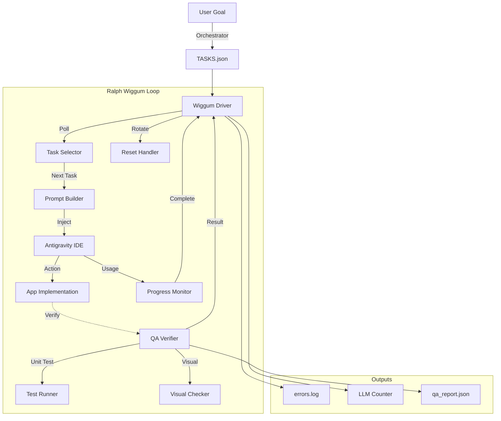
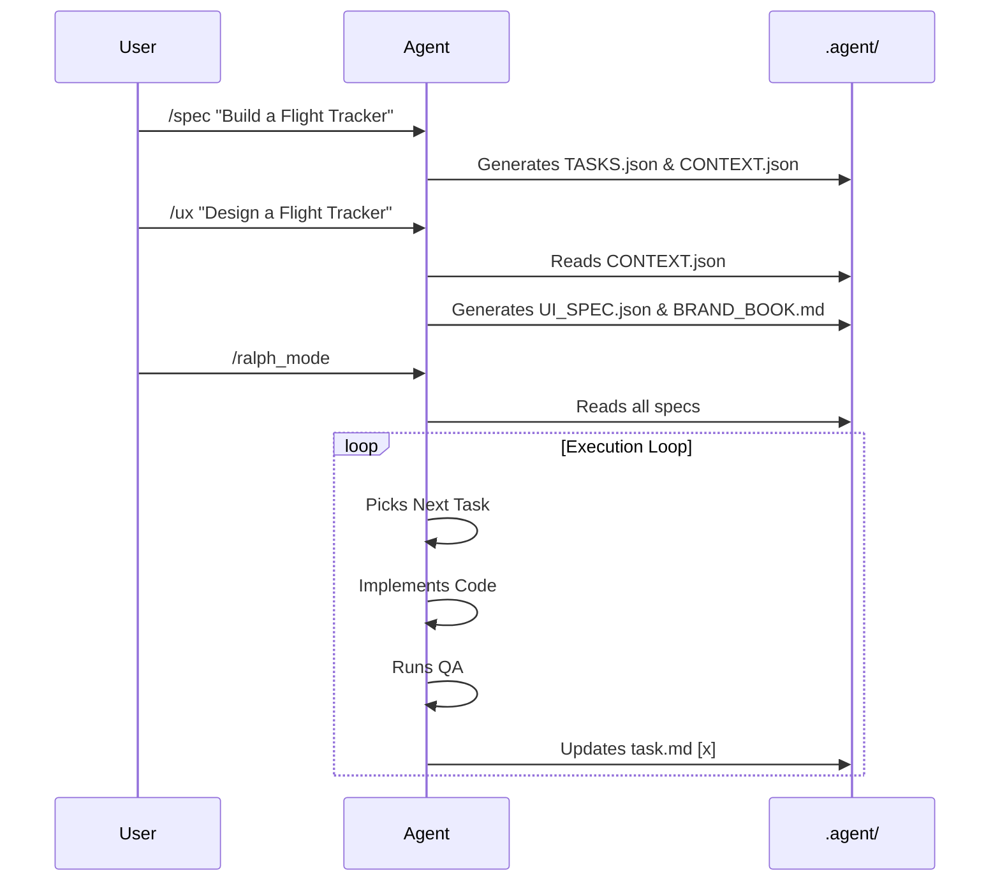

# 🍩 Ralph Wiggum Loop for Antigravity IDE

> *"I'm a unitard!"* — Ralph Wiggum

**An experimental implementation of the "Ralph Wiggum Loop" pattern for the Antigravity IDE.**

This project demonstrates how to achieve **autonomous, stateless agent execution** by driving the IDE via the Chrome DevTools Protocol (CDP).

## 🧠 The Concept

The "Ralph Wiggum Loop" is a design pattern for autonomous agents:
1.  **Fresh Context**: Examples, history, and "learnings" are cleared after *every* single task.
2.  **External Memory**: State is persisted only in file artifacts (e.g. `TASKS.json` or `task.md`), not in the LLM's context window.
3.  **"The Gutter" Avoidance**: By resetting the environment consistently, we prevent the degradation of reasoning that happens in long-running chat sessions.

> [!CAUTION]
> **SPEC = REQUIREMENT, NOT INSPIRATION**  
> Every field defined in `CONTEXT.json` is a mandatory contract.
> The driver now injects model requirements with enforcement language.
> Agents that skip or rename fields without updating the spec have FAILED the task.

## 🏗️ Architecture (V3 - Modular)



The codebase is organized into composable packages:

```text
├── wiggum_driver.py      # Main orchestrator (Driver)
├── orchestrator.py       # Plan generator (User Goal -> TASKS.json)
├── test_runner.sh        # Local test executor
├── loop/                 # Core loop components
│   ├── cdp_client.py     # Chrome DevTools Protocol communication
│   ├── task_selector.py  # Task parsing and dependency management
│   ├── task_parser.py    # JSON parsing and status tracking
│   ├── prompt_builder.py # Context injection
│   ├── progress_monitor.py # Completion polling & timestamping
│   └── reset_handler.py  # Context rotation (blast shield)
├── qa/                   # QA verification layers
│   ├── config.py         # QA Configuration
│   ├── schema_checker.py # Layer 1: Test existence
│   ├── test_runner.py    # Layer 2: Test execution (supports mocks)
│   └── visual_checker.py # Layer 3: Rule-based + Optional LLM check
├── qa_verification.py    # QA orchestrator (Result Aggregator)
├── tests/                # 56+ unit/integration tests
└── .agent/               # Project specs & logs
    ├── TASKS.json        # Executable task list
    ├── CONTEXT.json      # Model schemas and rules
    ├── task.md           # Progress scoreboard
    ├── errors.log        # Driver error log
    └── qa_report.json    # QA Verification Report
```

### Key Components

| Package | Purpose |
|---------|---------|
| `loop/` | Modular components for autonomous agent execution |
| `qa/` | 3-layer verification (test existence → execution → visual) |
| `tests/` | 56 pytest tests covering core logic |

### Agent Workflows

| Command | Agent | Output |
|---------|-------|--------|
| `/spec` | System Architect | `CONTEXT.json`, `TASKS.json` |
| `/ux` | UX Designer | `UI_SPEC.json`, `BRAND_BOOK.md` |
| `/ux_validation` | UX Validator | `UX_VALIDATION_REPORT.md` |
| `/ralph_mode` | Task Executor | Implements tasks from TASKS.json |
| `/ralph_mode` | Task Executor | Implements tasks from TASKS.json |

### Workflow Triggers


## 🚀 Getting Started

### Prerequisites
- Python 3.8+
- [Antigravity IDE](https://antigravity.dev) (or compatible fork)
- `pip install -r requirements.txt`

### Usage

1.  **Launch Antigravity with Remote Debugging**
    ```bash
    ./launch_ide.sh
    ```
    *(This ensures the IDE listens on port 9000)*

2.  **Define your Specs (The "Modern" Way)**
    Use the `/spec` command to generate your project plan. Then copy the key files:
    ```bash
    mkdir -p .agent
    cp /path/to/spec/TASKS.json .agent/
    cp /path/to/spec/CONTEXT.json .agent/
    ```

    *Alternatively (Legacy Mode), you can just edit `.agent/task.md` manually.*

3.  **Run the Driver**
    ```bash
    python3 wiggum_driver.py
    ```

    **Alternative: Generate Plans**
    ```bash
    python3 orchestrator.py "Build a todo app with React"
    ```

4.  **Run Tests**
    ```bash
    ./test_runner.sh all
    ```

### How the Driver Works
The driver prioritizes sources in this order:
1.  **`.agent/TASKS.json`** (Local Project Spec) - **Preferred**
2.  **`.agent/task.md`** (Legacy/Fallback)

It autonomously:
1.  Reads the next incomplete task from JSON.
2.  **Injects Context**: Adds globally relevant rules (from `CONTEXT.json`) and specific verification steps into the prompt.
3.  Sends the prompt to the IDE.
4.  Waits for the agent to mark the task as `[x]` in `task.md`.
5.  **Rotates Context** (reloads page) to keep the agent fresh.

## ⚠️ Safety Notes

- **Turbo Mode**: For full autonomy, set your IDE Review Policy to "Always Proceed".
- **Sandboxing**: Ensure your IDE has a "Terminal Command Deny List" enabled (e.g., blocking `rm -rf`) since the agent runs autonomously.

## 🛠️ Applying to Other Projects

To use this on a real project (e.g., your web app):

1.  **Copy Files**: Copy `wiggum_driver.py`, `launch_ide.sh`, and `requirements.txt` to your project root.
2.  **Create Folders**: Make sure `.agent/` and `.agent/workflows/` exist.
3.  **Copy Workflow**: Copy `ralph_mode.md` into `.agent/workflows/`.
4.  **Add Specs**: Place your `TASKS.json` and `CONTEXT.json` in `.agent/`.
5.  **Launch**: Run `./launch_ide.sh` and then `python3 wiggum_driver.py`.

## License

MIT
